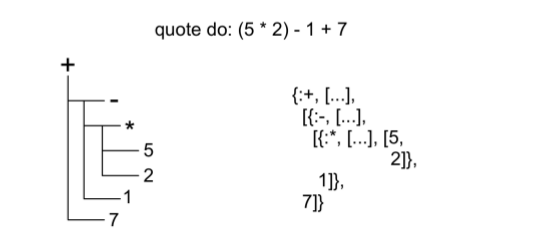
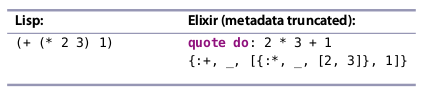

在进一步学习之前，需要记住，不要轻易使用宏，因为宏比普通程序更难以调试和跟踪，所以，如果不需要宏就能解决问题，那么最好还是不要写宏代码。

## AST 树揭秘

下面我们来深入的学习 AST 树，这是深入学习宏编程的必要条件，你会发现我们平时书写的 Elixir 代码比你想象中更为接近 AST 树。深入理解 AST 树可以帮助我们改变思考解决问题的方式。

## AST 树的结构

我们书写的 Elixir 代码，都可以用 AST 的三元组表示，前面我们已经学习过了

```elixir
defmacro say({:+, _, [lhs, rhs]}) do
```

下面我们来几个稍微复杂点的例子，看看 Elixir 中的函数是怎么用 AST 表达的：

```bash
iex(1)> quote do: (5 * 2) - 1 + 7
{:+, [context: Elixir, import: Kernel],
 [{:-, [context: Elixir, import: Kernel],
    [{:*, [context: Elixir, import: Kernel], [5, 2]}, 1]}, 7]}
iex(2)> quote do
...(2)>   defmodule MyModule do
...(2)>     def hello, do: "world"
...(2)>   end
...(2)> end
{:defmodule, [context: Elixir, import: Kernel],
 [{:__aliases__, [alias: false], [:MyModule]},
   [do: {:def, [context: Elixir, import: Kernel],
       [{:hello, [context: Elixir], Elixir}, [do: "world"]]}]]}
```

从上面可以看出，复杂的表达式是由嵌套的 AST 树表示的。实际上，所有的 Elixir 代码都可以用这样的三元组表示，它遵循这样的规则：

- 第一个元素是一个表示函数调用的原子 ，或者表示 AST 嵌套节点的元组

- 第二个元素是表示该表达式的元数据(我们并不关心什么是元数据)

- 第三个元素是一个代表函数参数的列表

让我们用上面 (5 * 2) - 1 + 7 这个例子来一一解释上面规则：

```bash
iex(1)> quote do: (5 * 2) - 1 + 7
{:+, [context: Elixir, import: Kernel],
 [{:-, [context: Elixir, import: Kernel],
    [{:*, [context: Elixir, import: Kernel], [5, 2]}, 1]}, 7]}
```

我们可以看到，AST 就是一颗由函数和函数参数组成的树，美化一下格式，我们就可以更清楚的理解这个树到底长啥样



根节点是一个 + 号，他的左右操作树是 7 和另一个嵌套的树，这个树的根节点是 - 号，左右操作数是 1 和另一棵树，以此类推......

### 高阶表达式和AST

为了帮助理解 Elixir 的表达是与 AST 的设计决策，我们用其他以 AST 树为核心的语言与 Elixir 做比较，比如 flavors 和 Lisp，在这些语言里，源代码直接以 AST 树的形式展现，写代码就是在写 AST 树。比如下图



如果去掉 Elixir AST 树三元组中间的元素，就和 Lisp 的代码十分接近。Elixir 的强大之处就在于能仅仅通过 quote 操作就能将高阶表达式转化为 AST 树。Lisp 的优势之一就是提供了可供程序员操作的 AST 树，但是代码表示起来并不是那么的自然也没有高阶的语法，而 Elixir 不仅提供了 AST 树的交互功能，还能用高阶的语法表示出来！

### AST 字面值

我们阅读 Elixir 的 AST 代码的时，有时候会发现 quote 操作后的代码有点生涩难懂甚至有悖常理，那是因为有几个 Elixir 的表达式的字面值在跟在 AST 树中的表示方式是一样的，包括：atoms integers floats lists strings 和任何包含前面元素的而元祖，比如

```bash
iex(1)> quote do: :atom
:atom
iex(2)> quote do: 123
123
iex(3)> quote do: 3.14
3.14
iex(4)> quote do: [1,2,3]
[1, 2, 3]
iex(5)> quote do: "string"
"string"
iex(6)> quote do: {:ok, 1}
{:ok, 1}
iex(7)> quote do: {:ok, [1,2,3]}
{:ok, [1, 2, 3]}
```

除此之外，其他的表达式，都会被转换成标准的 AST 树

```bash
iex(9)> quote do: %{a: 1, b: 2}
{:%{}, [], [a: 1, b: 2]}
iex(10)> quote do: Enum
{:__aliases__, [alias: false], [:Enum]}
iex(11)>
```

为了读写代码的时候不混淆，上面几个表达式和 AST 树表示一样的特殊类型，需要牢记在心。
