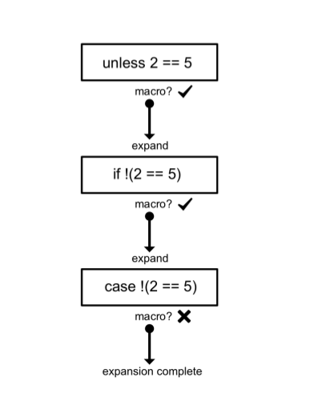

## Elixir 的砖瓦 ———— 宏

有了 AST 基础，下面我们就来重造几个 Elixir 的基本语法

### 重写 unless 宏

在其他语言中，unless 操作基本都是通过 if not 来实现的，但 Elixir 不同，unless 可以被实现为一个内部使用了 if 的基本语法。宏必须定义在模块内部，所以我们来定义一个 ControlFlow 模块 unless.exs

```elixir
defmodule ControlFlow do
  defmacro unless(exp, do: block) do
    quote do
      if !unquote(exp), do: unquote(block)
    end
  end
end
```

下面让我们的代码跑起来

```bash
iex(1)> c "unless.exs"
[ControlFlow]
iex(2)> require ControlFlow 
ControlFlow
iex(3)> ControlFlow.unless 5 == 5 do
...(3)>   "block entered"
...(3)> end
nil
```

使用宏之前，我们首先必须要 require 它，由于宏直接收 AST 当做变量，所以第一个变量可以是任意的合法表达式(会自动转换成 AST )，至于第二个变量，这里直接使用了模式匹配 do..end 然后把表达式放入其中。再次强调，宏接受 AST 作为参数，并且返回一个 AST 。所以上面我们的 unless 宏代码内就立即 quote 了所需代码，在 quote 代码内，我们用一行代码来生成了目标代码，其实就是把 unless 翻译成了 if! 语句，在生成的代码中 unless 关键字是不存在的。这里，我们依然使用了神器 unquote ～

### unquote

unquote 的作用是把已经定义的变量注入到 AST 树中。实际上，我们可以把 quote/unquote 看做字符串的 interpolation 操作。比如我们在产生一个字符串的时候，可能需要需要注入某些变量的值到字符串中，那我们就可以 interpolation 这个字符串，例如 python 中

```python
a = "inter"
s = "this is a string %s" % a
```

生成 AST 树的时候也是一样的，我们使用 quote 来生成一个 AST，然后使用 unqoute 来将外部数据注入到 AST 中，外部数据可以是：变量，表达式，代码块。

下面我们就来尝试一下，我们会使用 `Code.eval_quoted` 来直接执行我们的 AST 树并且返回结果。

```elixir
iex(5)> number = 5
5
iex(6)> ast = quote do
...(6)>   number * 10
...(6)> end
{:*, [context: Elixir, import: Kernel], [{:number, [], Elixir}, 10]}
iex(7)> Code.eval_quoted ast
** (CompileError) nofile:1: undefined function number/0
    (stdlib) lists.erl:1354: :lists.mapfoldl/3
        (elixir) lib/code.ex:200: Code.eval_quoted/3
iex(7)> ast = quote do
...(7)>  unquote(number) * 10
...(7)> end
{:*, [context: Elixir, import: Kernel], [5, 10]}
iex(8)> Code.eval_quoted ast
{50, []}
```

在第七行，我们可以看到 number 在 AST 树中的表示方法，如果不使用 unquote 的话，number 不能被识别，但在倒数第三航，使用了 unquote 之后，number 直接被翻译成了外部变量 number 的值 10

### 拓展宏

下面我们来看看 Elixir 编译时都干了些啥。

编译器在编译阶段遇到宏的时候就展开它，如果展开的宏里还有宏，那么就一直递归的展开这些宏，直到所有的宏都被展开完了。

我们还是看上面的 unless 宏，下图表示了编译器在编译代码的时候是如何做决策的：

```elixir
Controlflow.unless 2 == 5 do
  "block entered"
end
```



我们知道我们的 unless 宏生成了一个 if 表达式，所以编译器实际上会把上面代码展开成这种样式

```elixir
if !(2==5) do
  "block entered"
end
```

然后编译器发现 if 也是一个宏，于是由继续展开成了 case 表达式

```elixir
case !(2==5) do
  x when x in [false ,nil] ->
    nil
  _ -> "block entered"
end
```

现在，我们的代码就没有可以展开的宏了，编译器的宏展开就完了，然后继续做其他处理。 case 宏是一个特殊的宏，定义在 Kernel.SpecialForms ，这些特殊的宏是 Elixir 的基本块，他们不能被覆盖重写。

下面我们再用 `Macro.expand_once` 来一步一步的看，嵌套宏是怎么展开的

```elixir
iex(1)> c "unless.exs"
[ControlFlow]
iex(2)> require ControlFlow 
ControlFlow
iex(3)> ast = quote
quote/2    
iex(3)> ast = quote do 
...(3)>   ControlFlow.unless 2 == 5, do: "block entered"
...(3)> end
{{:., [], [{:__aliases__, [alias: false], [:ControlFlow]}, :unless]}, [],
 [{:==, [context: Elixir, import: Kernel], [2, 5]}, [do: "block entered"]]}
iex(4)> expand_once = Macro.expand_once(ast, __ENV__)
{:if, [context: ControlFlow, import: Kernel],
 [{:!, [context: ControlFlow, import: Kernel],
    [{:==, [context: Elixir, import: Kernel], [2, 5]}]}, [do: "block entered"]]}
iex(5)> expand_fully = Macro.expand_once(expand_once, __ENV__)
{:case, [optimize_boolean: true],
 [{:!, [context: ControlFlow, import: Kernel],
    [{:==, [context: Elixir, import: Kernel], [2, 5]}]},
      [do: [{:->, [],
           [[{:when, [],
                   [{:x, [counter: -576460752303423461], Kernel},
                            {:in, [context: Kernel, import: Kernel],
                                      [{:x, [counter: -576460752303423461], Kernel}, [false, nil]]}]}],
                                            nil]}, {:->, [], [[{:_, [], Kernel}], "block entered"]}]]]}
```

清晰明了


