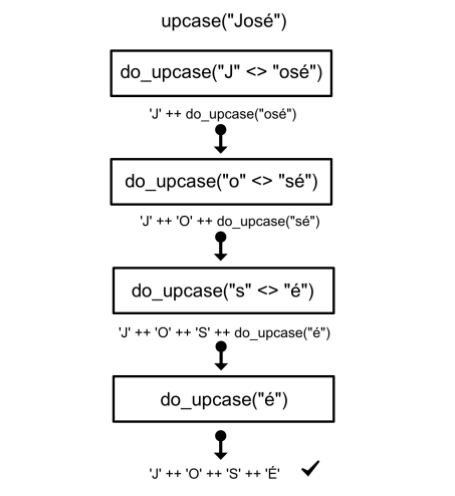

## 从外部数据生成代码

从外部数据生成代码听起来可能有些不切实际，但 Elixir 就能这么干，String.Unicode 就是这么实现的，它在编译的时候通过读取外部文件生成了成千上万个函数，这些函数使用模式匹配来保证调用时的高效，多说无益，我们下面就来看看 String.Unicode 这个库是怎么实现的吧。

String.Unicode 并没有像我们平时想象的那样把所有的 Unicode 都转换成一定的数据结构（比如 map）来放在代码里进行读取，而是存在一个叫 UnicodeData.txt 的文件中，这个文件包含了所有已知的 unicode code-point 映射。在编译时，会读取这些 code-point 映射来生成一堆代码。这里是他工作原理的简要描述：

Unicodedata.txt 取样

```bash
```

Unicodedata.txt 总用有 27000 多行，String.Unicode 在编译的时候会将他们全部读取，并为每一行都生成独立的函数，下面是生成后的代码的取样

```elixir
defmodule String.Unicode do
    ...
    def upcase(string), do: do_upcase(string) |> IO.iodata_to_binary
    ...
    defp do_upcase("é" <> rest) do
        :binary.bin_to_list("É") ++ do_upcase(rest)
    end
    defp do_upcase(" ć " <> rest) do
        :binary.bin_to_list(" Ć ") ++ do_upcase(rest)
    end
    defp do_upcase("ü" <> rest) do
        :binary.bin_to_list("Ü") ++ do_upcase(rest)
    end
    ...
    defp do_upcase(char <> rest) do
        :binary.bin_to_list(char) ++ do_upcase(rest)
    end
    ...
end
```

这个模块编译后，包含了成千上万这样的函数，当我们 convert 一个像 `Thanks José!` 这样的字符串的时候，String.Unicode 只是简单的递归调用 do_upcase/1，下面这幅图就简单的描述了一个字符串的解析流程



得益于 Elixir 虚拟机的模式匹配，我们只需要写很少量的代码，就能操作 Unicode。更棒的是，每当又新的元素加入 Unicodedata.txt 的时候，我们都可以通过 mix compile 来重新生成一遍。
